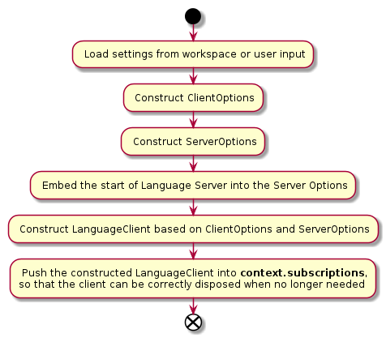
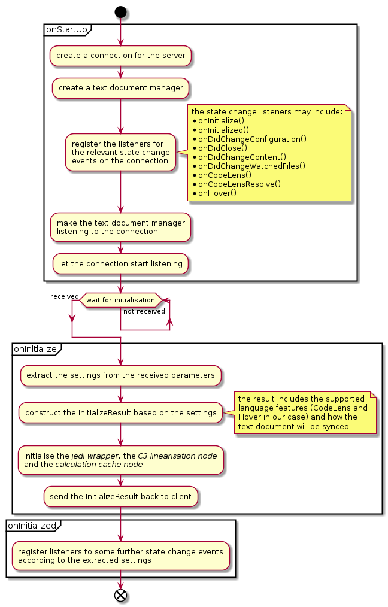
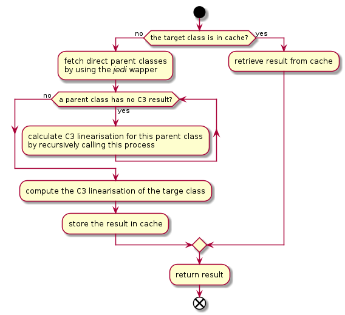
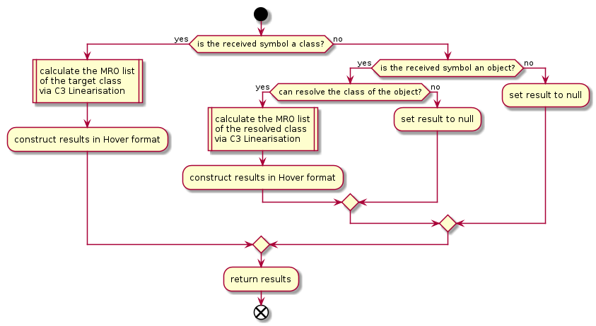

# Activity Diagram

There are six main activities:

1. The lifecycle of the client
2. The lifecycle of the server
3. C3 Linearisation calculation
4. The CodeLens service
5. The Hover service
6. The Hover Method service

The details of the last three services can be found in the [Use Case Diagram](./use_case_diagram.md).

The following activity diagrams illustrate the details of the above six activities.

## Lifecycle of the client

## Lifecycle of the server

## C3 linearisation

## CodeLens service

## Hover service

## Hover Method service

