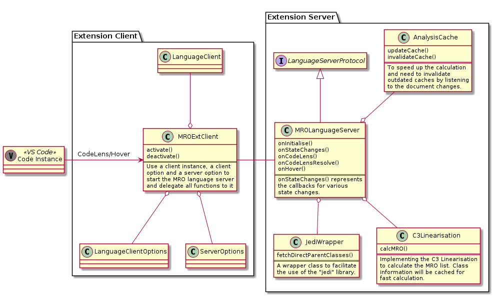

# Project Structure and Class Diagram

Normally there are two ways to implement a language feature extension, either to directly implement the `languages.*` API or to build a simple custom Language Server following the *Language Server Protocol*.
In this project, the latter approach is chosen, mainly because of the following points:

1. We can write the Language Server in Python and leverage the power of the `jedi` library.
2. We can have better control over the resource-intensive operations around static analysis, like finding the parent classes of a class.
3. we can easily extend the features of this extension in the future thanks to the *Language Server Protocol*.

## Project Structure

By adopting the Language Server approach, the extension can be divided into two parts, the **client side** and the **server side**.

### Client Side

The client's responsibility is relatively simple. It only needs to:

1. construct client options and server options from settings or inputs;
2. prepare a connection to an instance of the Language Server;
3. start a LanguageClient with the client options, the server options and the prepared connection;
4. delegate all future requests to the server and reply the requests with the returned results from the server.

### Server Side

The server must implement the **Language Server Protocol**.
However, as the use cases are only relevant to the CodeLens and Hover features, the server does not need to implement the other features.

Every time there is a request, the server will use *jedi* for semantic queries like finding the target class and all its direct parent classes.

Once all relevant classes are found, a custom implementation of the C3 linearisation will be used to calculate the MRO list of the target class.

Caches can be used to speed up the sematic queries and/or the MRO list calculation.

The server is also responsible for maintaining its internal state for all VS Code instance state changes.

## Class Diagram

The following diagram illustrates the above project structure.

