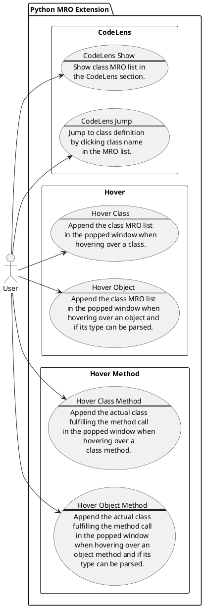

# Use Cases

The main purpose of this VS Code Extension is to facilitate the inspection of the Method Resolution Order of a Python class.
All the use cases are conceived around this main purpose.

## List of Use Cases

1. **CodeLens Show**: The user can view the MRO of a Python class by clicking the correspondent tag at the CodeLens section in front of the class definition, which will show the MRO list in the newly-occurred interspersed section.
2. **CodeLens Jump**: The user can click a class name, other than the inspected one, in the appeared MRO list and jump to the correspondent definition of the clicked class.
3. **Hover Class**: When the user hovers over a class, append the MRO list of the class to the popped contextual information window.
4. **Hover Object**: When the user hovers over an instance and the class of the instance can be parsed via type hint, append the MRO list of the class to the popped contextual information window.
5. **Hover Class Method**: When the user hovers over a class method or a static method of a class and the class delegates the method to one of its parent class, append the parent class, which actually fulfils the method call, to the popped contextual information window.
6. **Hover Object Method**: When the user hovers over a method of an instance and the class of the instance can be parsed via type hint, append the actual class fulfilling the method call, which may be a parent class of the parsed one, to the popped contextual information window.

## Use Case Diagram

The following diagram illustrates the above use case list.

